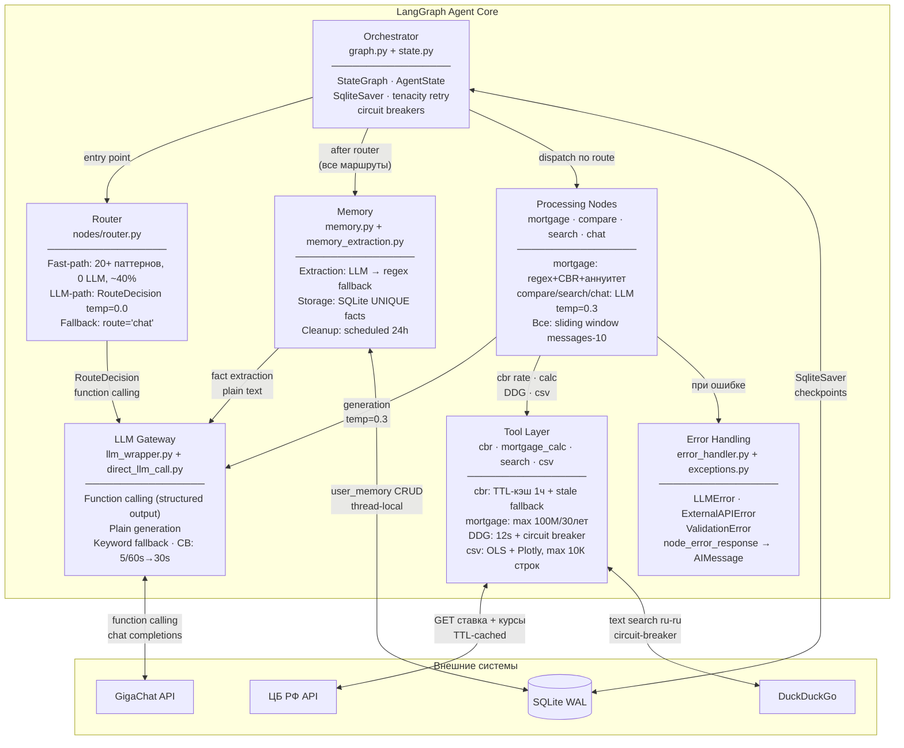

# C4 Component Diagram — LangGraph Agent Core

Внутреннее устройство ядра агента.

> 7 смысловых компонентов. Задача — показать интерфейсы между блоками, а не перечислить файлы.

## Интерфейсы между компонентами

| От | К | Интерфейс | Fallback |
|---|---|---|---|
| Orchestrator | Router | `router_node(state) → state` | route="chat" |
| Orchestrator | Memory | `memory_extraction_node(state) → state` | silent skip |
| Orchestrator | Processing | `*_node(state) → state` | `node_error_response()` |
| Router | LLM Gateway | `llm_call_direct(dialog, RouteDecision, temp=0)` | route="chat" |
| Processing | LLM Gateway | `llm_call_direct(dialog, temp=0.3)` | keyword/template |
| Processing | Tool Layer | `get_current_rate()`, `calculate_mortgage()`, `search_real_estate()` | ExternalAPIError |
| LLM Gateway | GigaChat API | HTTPS OAuth2, function calling / plain | keyword fallback |
| Tool Layer | CBR API | HTTPS 10s timeout | stale cache |
| Tool Layer | DDG | HTTPS 12s timeout, circuit breaker | ExternalAPIError |
