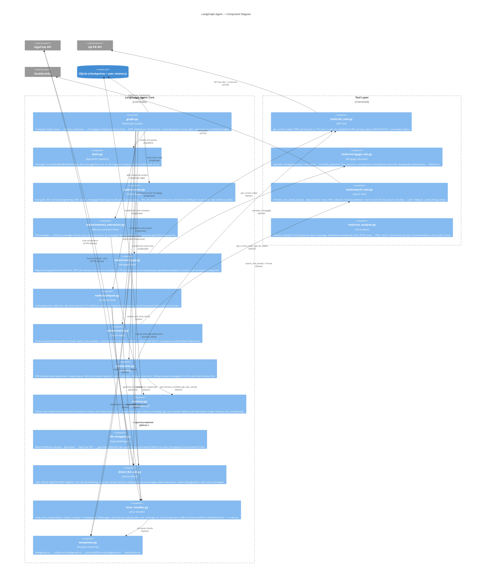

# C4 Component Diagram — LangGraph Agent Core

Внутреннее устройство ядра агента.

```mermaid
C4Component
    title LangGraph Agent — Component Diagram

    System_Ext(gigachat_api, "GigaChat API")
    System_Ext(cbr_api, "ЦБ РФ API")
    System_Ext(ddg_api, "DuckDuckGo")
    ContainerDb(sqlite, "SQLite (checkpoints + user_memory)")

    Container_Boundary(agent_core, "LangGraph Agent Core") {

        Component(graph, "graph.py", "StateGraph builder", "Собирает граф: router → memory_extraction → [mortgage|compare|search|chat] → END. SqliteSaver checkpointer. route_decision() и route_after_memory() как conditional edges.")

        Component(state, "state.py", "AgentState TypedDict", "messages: Annotated[list[BaseMessage], add_messages]\nroute: str (mortgage|compare|search|chat)\nuser_id: str")

        Component(router_node, "nodes/router.py", "Intent Router", "Fast-path: 20+ паттернов (greeting, CBR, search, mortgage follow-up).\nLLM-path: create_dialog → llm_call_direct(RouteDecision, temp=0.0).\nFallback: route='chat' при любой ошибке.")

        Component(memory_extraction, "nodes/memory_extraction.py", "Memory Extraction Node", "Thin wrapper → memory_manager.extract_and_store_facts(user_id, message). Выполняется после роутера для ВСЕХ маршрутов.")

        Component(mortgage_node, "nodes/mortgage.py", "Mortgage Node", "Regex parsing (amount/rate/term). CBR rate lookup если ставка не указана (+2% spread). Аннуитетная формула (детерминировано). Context scan истории сообщений.")

        Component(compare_node, "nodes/compare.py", "Compare Node", "LLM сравнение через llm_call_direct (temp=0.3).\nFallback шаблоны: первичка/вторичка, центр/спальный район, generic prompt.")

        Component(search_node, "nodes/search.py", "Search Node", "Очистка query (name prefix removal). search_real_estate() → format_search_results(). Fallback: шаблонный текст с ссылками на ЦИАН/Авито/ДомКлик.")

        Component(chat_node, "nodes/chat.py", "Chat Node", "CBR fast-path для запросов о ставке/курсах. Memory context injection. System prompt с domain restriction. Sliding window messages[-10:]. llm_call_direct (temp=0.3).")

        Component(memory, "memory.py", "LongTermMemory", "SQLite user_memory (thread-local connections). extract_and_store_facts(): LLM→regex fallback. get_memory_context(), get_user_name(). delete_user_facts() для /forget. cleanup_old_checkpoints().")

        Component(llm_wrapper, "llm_wrapper.py", "GigaChatWrapper", "BaseChatModel subclass. _generate() → GigaChat SDK → _generate_fallback() при ошибке. Keyword-based fallback по topic (mortgage/compare/search/chat).")

        Component(direct_llm, "direct_llm_call.py", "DirectLLMCall", "_get_client(): GigaChat SDK singleton. llm_call_direct(dialog, structure, temp): function calling если structure задан, plain text иначе. create_dialog(system, user, prev_messages).")

        Component(error_handler, "error_handler.py", "Error Handler", "node_error_response(exc, node): логирует + возвращает AIMessage с user-facing сообщением. user_message_for_error(): маппинг LLMError/ExternalAPIError/ValidationError → ru тексты.")

        Component(exceptions, "exceptions.py", "Exception Hierarchy", "FlatAgentError → LLMError\nFlatAgentError → ExternalAPIError\nFlatAgentError → ValidationError")
    }

    Container_Boundary(tools_layer, "Tool Layer") {
        Component(cbr_tool, "tools/cbr_tool.py", "CBR Tool", "get_current_rate(): HTML parsing cbr.ru, TTL-кэш 1ч. get_cbr_data(date): XML parsing, курсы USD/EUR/CNY + ключевая ставка.")

        Component(mortgage_calc, "tools/mortgage_calc.py", "Mortgage Calculator", "calculate_mortgage(amount, rate, term) → {monthly_payment, total_payment, overpayment, overpayment_percent}. Валидация параметров → ValueError.")

        Component(search_tool, "tools/search_tool.py", "Search Tool", "enhance_real_estate_query(). _ddg_search() + retry. filter_relevant_results() (whitelist + term score). format_search_results() → LLM + fallback. _build_listing_links().")

        Component(csv_analysis, "tools/csv_analysis.py", "CSV Analysis", "analyze_csv(path): OLS регрессия цена~площадь. Выявление выбросов (±2σ). Plotly chart → PNG. result = {summary, ols_text, recommendation, chart_path, error}.")
    }

    Rel(graph, state, "creates and passes", "TypedDict")
    Rel(graph, router_node, "entry point node", "LangGraph")
    Rel(graph, memory_extraction, "after router (all routes)", "LangGraph edge")
    Rel(graph, mortgage_node, "conditional route=mortgage", "LangGraph")
    Rel(graph, compare_node, "conditional route=compare", "LangGraph")
    Rel(graph, search_node, "conditional route=search", "LangGraph")
    Rel(graph, chat_node, "conditional route=chat", "LangGraph")
    Rel(graph, sqlite, "SqliteSaver checkpoints", "SQLite WAL")

    Rel(router_node, direct_llm, "classify intent (RouteDecision)", "function calling")
    Rel(memory_extraction, memory, "extract_and_store_facts()", "Python")

    Rel(mortgage_node, cbr_tool, "get_current_rate()", "Python")
    Rel(mortgage_node, mortgage_calc, "calculate_mortgage()", "Python")
    Rel(mortgage_node, error_handler, "node_error_response()", "Python")

    Rel(compare_node, direct_llm, "generate comparison", "plain text")
    Rel(compare_node, error_handler, "node_error_response()", "Python")

    Rel(search_node, search_tool, "search_real_estate() + format", "Python")
    Rel(search_node, error_handler, "node_error_response()", "Python")

    Rel(chat_node, cbr_tool, "get_current_rate() / get_cbr_data()", "Python")
    Rel(chat_node, memory, "get_memory_context(), get_user_name()", "Python")
    Rel(chat_node, direct_llm, "generate response", "plain text")

    Rel(memory, sqlite, "user_memory CRUD", "SQLite WAL thread-local")

    Rel(direct_llm, gigachat_api, "function calling + chat", "HTTPS OAuth2")
    Rel(llm_wrapper, gigachat_api, "chat completions", "HTTPS OAuth2")
    Rel(cbr_tool, cbr_api, "GET key rate + currencies", "HTTPS")
    Rel(search_tool, ddg_api, "text search", "HTTPS")

    Rel(router_node, exceptions, "raises on error → fallback", "Python")
    Rel(mortgage_node, exceptions, "ValidationError, ExternalAPIError", "Python")
    Rel(error_handler, exceptions, "isinstance checks", "Python")
```
