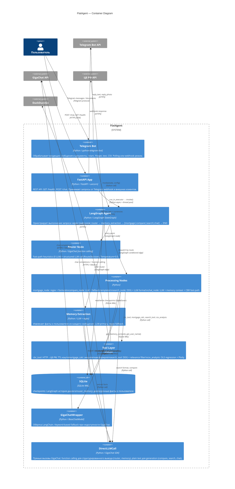

# C4 Container Diagram — FlatAgent

Frontend / backend, orchestrator, retriever, tool layer, storage, observability.

## Описание контейнеров

| Контейнер | Технология | Роль |
|---|---|---|
| Telegram Bot | python-telegram-bot | Интерфейс пользователя (основной), обработка документов |
| FastAPI App | FastAPI + uvicorn | REST API, Telegram webhook endpoint, healthcheck |
| LangGraph Agent | LangGraph StateGraph | Оркестратор: граф переходов, state management, checkpointing |
| Router Node | GigaChat function calling | Intent classification, 0 LLM для fast-path |
| Memory Extraction | LLM + regex | Cross-session facts extraction per user |
| Processing Nodes | Python + LLM | Domain logic: ипотека, сравнение, поиск, консультация |
| Tool Layer | Python + httpx + ddgs | Внешние данные: ЦБ РФ, поиск, расчёты, CSV |
| GigaChatWrapper | LangChain BaseChatModel | LangChain-compatible LLM с keyword fallback |
| DirectLLMCall | GigaChat SDK | Structured output (function calling), plain generation |
| SQLite | SQLite WAL | Persistence: checkpoints + user memory |
