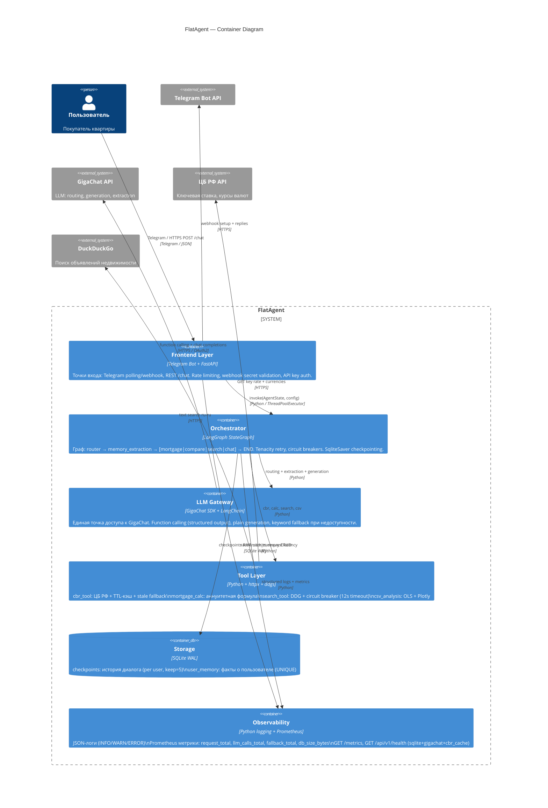

# C4 Container Diagram — FlatAgent

Frontend / backend, orchestrator, retriever, tool layer, storage, observability.

## Описание контейнеров

| Контейнер | Технология | Роль | Fallback |
|---|---|---|---|
| Frontend Layer | Telegram Bot + FastAPI | Точки входа, rate limiting, auth | Polling ↔ webhook |
| Orchestrator | LangGraph StateGraph | Граф переходов, retry, checkpointing | route="chat" |
| LLM Gateway | GigaChat SDK | Structured output + generation | keyword fallback |
| Tool Layer | Python + httpx + ddgs | ЦБ РФ, поиск, расчёт, CSV | TTL-кэш, circuit breaker |
| Storage | SQLite WAL | Checkpoints + user memory | Критическая зависимость |
| Observability | logging + Prometheus | Логи, метрики, health check | — |
