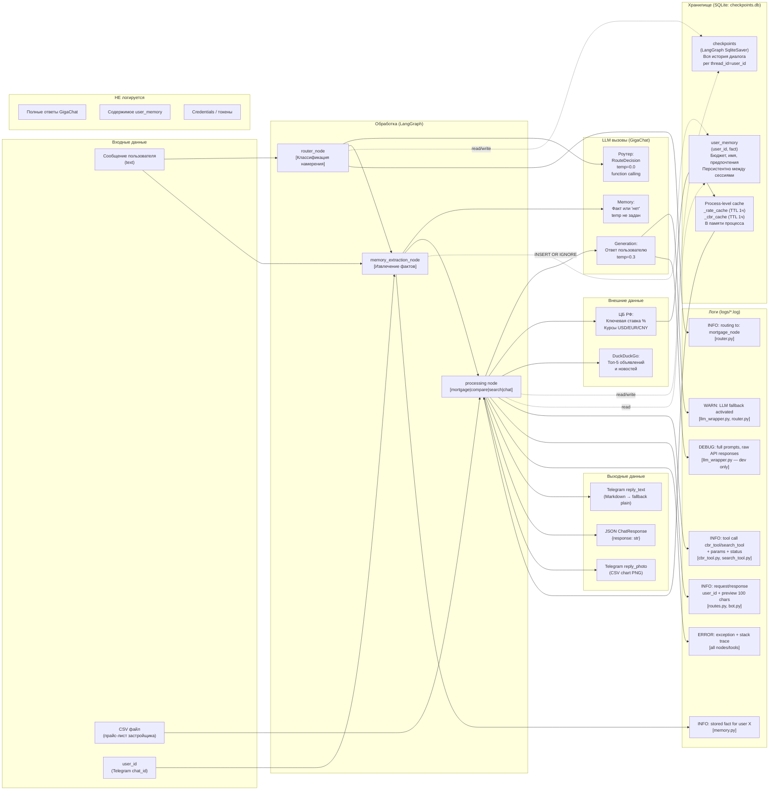

# Data Flow Diagram — FlatAgent

Как данные проходят через систему, что хранится, что логируется.



## Детализация: что хранится

### SQLite: checkpoints (LangGraph)

```
thread_id = user_id (Telegram chat_id)
    └── checkpoint_id (UUID)
        └── messages: [HumanMessage, AIMessage, ...]
        └── route: str
        └── user_id: str

Retention: keep_per_thread=5 (cleanup_old_checkpoints)
Size target: ≤100 KB per user
WAL mode: да
```

### SQLite: user_memory

```
user_id TEXT  ← Telegram числовой ID (не имя пользователя)
fact    TEXT  ← "Пользователь <факт>" (одно предложение)
UNIQUE(user_id, fact)  ← дедупликация

Примеры фактов:
- "Пользователя зовут Алексей"
- "Бюджет пользователя: 8 млн"
- "Пользователь упомянул семью: жена и двое детей"
- "Пользователь ищет квартиру в Митино"

Удаление: /forget или /start → DELETE WHERE user_id = ?
```

### Process-level cache (не персистируется)

```
_rate_cache: ("Ключевая ставка ЦБ РФ: 21.0% (с 25.10.2024)", timestamp)
_cbr_cache: {"2024-10-25": ("Курсы валют...", timestamp)}
_llm_instance: GigaChatWrapper singleton
_client: GigaChat SDK client singleton
```

## Детализация: что логируется vs что нет

| Данные | Логируется | Уровень | Причина |
|---|---|---|---|
| user_id + routing decision | Да | INFO | Диагностика роутинга |
| Имя инструмента + параметры | Да | INFO | Аудит tool calls |
| Статус вызова LLM (успех/ошибка) | Да | INFO/ERROR | Мониторинг доступности |
| Количество токенов GigaChat | Нет (TODO) | — | Контроль бюджета |
| Preview ответа (100 символов) | Да | INFO | Базовая диагностика |
| Полный ответ GigaChat | Нет | — | Приватность |
| Содержимое user_memory | Нет | — | Персональные данные |
| Credentials, токены | Нет | — | Безопасность |
| Full prompts (raw) | Только DEBUG | DEBUG | Dev-only |
| HTTP latency per node | Нет (TODO) | — | Нужен для SLO мониторинга |
| Error stack traces | Да | ERROR | Отладка |
| Нестандартно длинные сообщения >2000 | Да | WARN | Potential injection detection |

## Data Sensitivity Classification

| Тип данных | Класс чувствительности | Хранение | Передача 3-м лицам |
|---|---|---|---|
| Telegram user_id (числовой) | Публичный идентификатор | SQLite local | Нет |
| Факты из диалога (имя, бюджет) | Персональные данные | SQLite local | Нет |
| Тексты сообщений | Персональные данные | SQLite (checkpoints) | GigaChat API |
| CSV данные застройщика | Пользовательский контент | Temp файл (удаляется) | Нет |
| Ключевая ставка ЦБ | Публичные данные | Process cache | Нет |
| Результаты поиска DDG | Публичные данные | Не хранятся | Нет |
