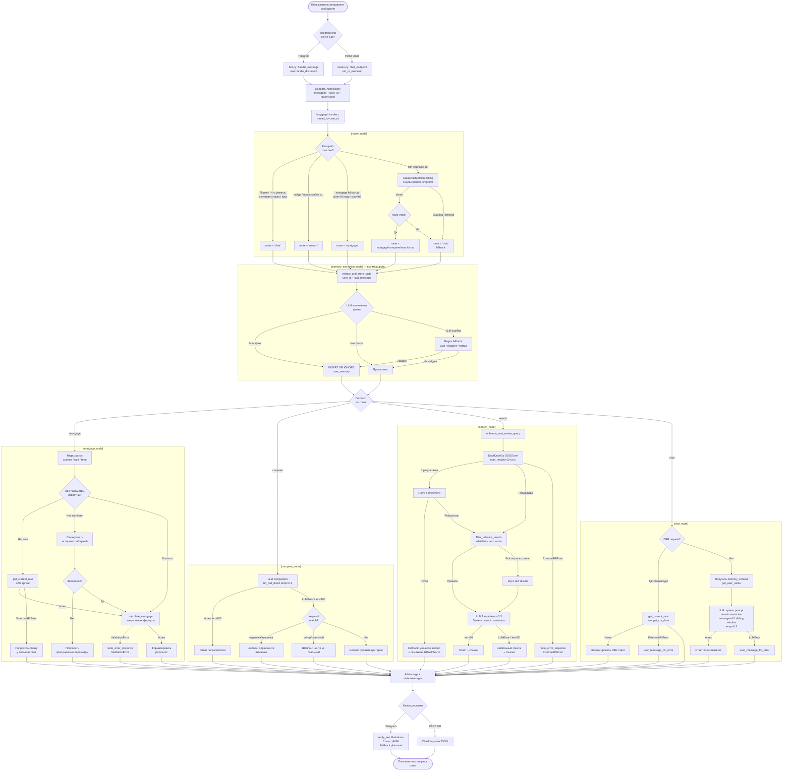

# Workflow Diagram — Request Execution Flow

Пошаговое выполнение запроса, включая ветки ошибок.

## Легенда ветвей ошибок

| Ветка ошибки | Триггер | Поведение |
|---|---|---|
| LLM недоступен (router) | GigaChat timeout/exception | `route = "chat"`, продолжение |
| LLM недоступен (compare) | `LLMError` или `len < 100` | Keyword-based fallback шаблон |
| LLM недоступен (search format) | `LLMError` или `len < 50` | Шаблонный список + ссылки |
| LLM недоступен (chat) | `LLMError` | "Сервис временно недоступен" |
| CBR API недоступен | `ExternalAPIError` | Кэш (1ч) или просим ввести вручную |
| DDG недоступен | `ExternalAPIError` | "Не удалось получить данные" |
| ValidationError (ипотека) | Негативные/нулевые параметры | "Некорректные параметры" |
| Пустой DDG результат | `results == []` | Текстовый совет + ссылки |
| Telegram Markdown fail | Исключение при `reply_text` | Retry без `parse_mode='Markdown'` |
